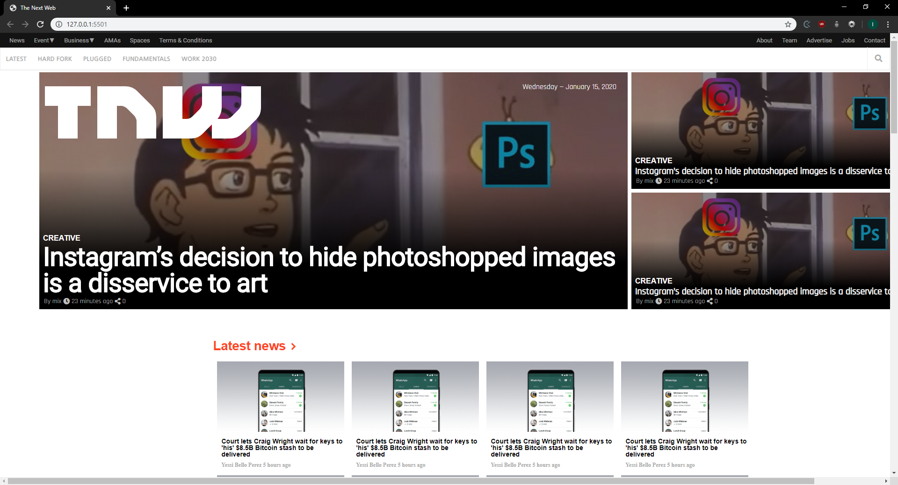

# HTML Responsive Design - The Next Web Project

> This is our sixth project in the HTML/CSS section of the Microverse main curriculum. The goal of this project is to let us develop the ability to design responsive layouts, using media queries and different styles at certain breaking points.

This has been by far our biggest and most complex assignment, but we've learned a great deal in responsive design.

## Built With

- HTML,
- CSS

## Preview

[Preview Link](https://raw.githack.com/Cyrus-Kiprop/the-next-web/main-feature-branch/index.html)

## Authors

👤 **Cyrus Kiprop**

- Github: [@Cyrus-Kiprop](https://github.com/Cyrus-Kiprop)

👤 **Ivan Diaz**

- Github: [@ivanid22](https://github.com/ivanid22)

## Show your support

Give a ⭐️ if you like this project!
